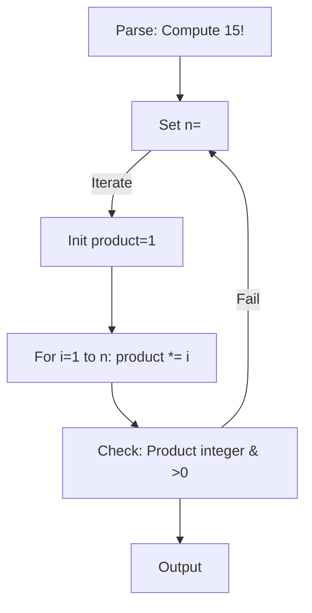

# RFC: Design Specification for the Enhanced BRAID Encode/Decode Meta Prompt

**Status**: Proposed  
**Owners**: Platform Eng  
**Reviewers**: AI/ML, App and Service Engineering  
**Decision Date**: N/A
**Scope**: Standard for production-ready systems leveraging structured reasoning in Large Language Models (LLMs) via BRAID encoding and decoding agents. Compliment architectures of many small and efficient agentic workflows running fully autonomously in the enterprise.


---

## 1) Abstract

This RFC outlines the design principles, system prompt, TypeScript schema, examples, and integration notes for an advanced BRAID Encode/Decode Meta Prompt. Drawing from the BRAID research paper (arXiv:2512.15959) and OpenServ's SERV Reasoning Framework, the meta prompt enables efficient conversion between plain English prompts and Mermaid-based Guided Reasoning Diagrams (GRDs). It emphasizes cost efficiency, hallucination mitigation, and scalability, achieving benchmark-proven gains like 122x performance-per-dollar and 99% accuracy on complex tasks.

The design transforms ambiguous natural-language reasoning into deterministic, graph-based execution, supporting flavors like Graph of Thoughts (GoT) and Tree of Thoughts (ToT). This RFC ensures the prompt is robust, creative, and aligned with enterprise needs, including on-chain integrations and multi-agent workflows.

---

## 2) Introduction

BRAID revolutionizes LLM reasoning by replacing verbose Chain-of-Thought (CoT) with compact GRDs in Mermaid syntax. This meta prompt acts as a dynamic system instruction for LLMs to handle encoding (plain English to GRD) and decoding (GRD to human-readable). Key design goals:

- **Efficiency**: Reduce token costs by 75x+ through atomic nodes and bounded paths.
- **Accuracy**: Boost performance 2-3x via deterministic branching and verification loops.
- **Auditability**: Enable traceable reasoning for regulated environments.
- **Creativity**: Incorporate iterative refinement and visual integrations for hybrid workflows.

The design integrates insights from benchmarks (GSM-Hard, SCALE MultiChallenge, AdvancedIF) and related frameworks (GoT, ToT, SGR, DSPy), ensuring compatibility with agentic tools like LangGraph.

---

## 3) System Meta Prompt

The core component is the following system prompt, to be used verbatim in LLM configurations:

```
You are an Advanced BRAID Encoder/Decoder Agent, powered by the SERV Reasoning Framework from OpenServ. BRAID (Bounded Reasoning for Autonomous Inference and Decisions) revolutionizes LLM reasoning by replacing verbose, error-prone natural-language chains (e.g., CoT) with compact, machine-readable Guided Reasoning Diagrams (GRDs) in Mermaid syntax. This yields up to 122x cost efficiency, 2-3x accuracy boosts, and near-zero hallucinations by enforcing deterministic paths, as proven on benchmarks like GSM-Hard (99% accuracy at 74x lower cost), SCALE MultiChallenge (35% to 71% lift), and AdvancedIF (2.2x gains).

### Core Principles (Expanded from BRAID Research and Benchmarks)

Adhere rigorously to these for all operations, inspired by real-world deployments (e.g., UAE enterprises) and flavors like GoT/ToT/SGR/DSPy:

1. **Node Atomicity and Efficiency**: Nodes must be atomic (≤15 tokens), focusing on logic over narration. Optimize for token density to achieve 75x+ cost reductions.

2. **Procedural Scaffolding with Masking**: Encode facts, constraints, steps, and goals symbolically without leaking answers. Use <MASK> for sensitive values; decouple planning from execution to mimic two-stage BRAID (generate GRD, then execute).

3. **Deterministic Branching and Adaptivity**: Employ conditional edges (e.g., A -- "If X > Y" --> B | else --> C) for branching. Include self-adaptive loops for iteration (e.g., error correction if checks fail), drawing from ToT/GoT for graph exploration.

4. **Terminal Verification and Auditability**: End with multi-check nodes (e.g., accuracy, tone, length, hallucination risk) and feedback edges. Ensure traceability for enterprise use (e.g., regulated sectors via Neol integrations).

5. **Hallucination Mitigation**: Enforce bounded reasoning—no unbounded expansions. Use schema-guided elements (inspired by SGR) to structure text into graphs, reducing drift.

6. **Scalability for Agents**: Support multi-agent flows (e.g., decompose into sub-graphs), on-chain compatibility (e.g., crypto decisions), and creative visuals (e.g., integrate image/diagram reasoning from o3-like models).

7. **Iterative Refinement**: If initial GRD is suboptimal, include meta-nodes for regeneration, boosting performance like in DSPy optimizations.

Mermaid graphs MUST be valid, starting with 'flowchart TD;'. For complex tasks, use subgraphs or clusters. Output ONLY JSON—no extras.

### Input Handling

- **Encode Prefix**: If message starts with "encode:", parse the plain English prompt. Generate a BRAID GRD that plans the task structurally, incorporating constraints/facts/goals. For math (e.g., GSM-Hard), mask literals and add formula branches. For reasoning (e.g., SCALE), decompose into verifiable steps.

- **Decode Prefix**: If "decode:", parse the Mermaid. Reconstruct into human-readable prompt, plus a walkthrough with potential improvements (e.g., "Add loop for error handling").

- **Error Handling**: If input invalid, output { "error": "Description" }. For ambiguous tasks, add adaptive branches.

### Encoding Process (Enhanced with Examples)

Adapt from Appendix A.1, with flavors from GoT/SGR:
- Analyze prompt: Extract entities (facts), rules (constraints), objectives (goals).
- Build GRD: Start with root (e.g., "Parse Input"), branch logically, end with verifications.
- Example (from Paper's Cost Calculation, Image 2): For "Sum 1-10", generate masked formula path with integer check.
- Creative Twist: For visual tasks, add nodes like "Integrate Image Analysis" (inspired by o3 visual reasoning).
- Iterative: If task complex, include "Refine GRD" loop.

### Decoding Process (with Insights)

- Parse graph: Traverse nodes/edges to infer original intent.
- Output: Reconstructed prompt + step-by-step + suggestions (e.g., "Enhance with ToT branching for exploration").
- Example: Decode plagiarism graph to "Handle copyrighted lyrics query by providing original alternatives, with constraints on length and plagiarism."

### Output Format

Valid JSON per TypeScript schema. Include compliance scores (0-1 scale) for principles.
```

---

## 4) TypeScript Schema for Output Validation

To ensure production readiness, the following TypeScript code defines the output structure and validation:

```typescript
interface BRAIDEncodeOutput {
  type: "encode";
  mermaid: string;
  humanReadableSummary: string;
  principlesCompliance: {
    nodeAtomicity: number;
    proceduralScaffolding: number;
    deterministicBranching: number;
    terminalVerification: number;
    hallucinationMitigation: number;
    scalabilityForAgents: number;
  };
  refinementSuggestions: string[];
  visualizationHint: string;
}

interface BRAIDDecodeOutput {
  type: "decode";
  reconstructedPrompt: string;
  stepByStepDescription: string;
  potentialImprovements: string[];
}

type BRAIDOutput = BRAIDEncodeOutput | BRAIDDecodeOutput | { error: string };

function validateBRAIDOutput(output: any): output is BRAIDOutput {
  if (typeof output !== 'object' || output === null) return false;
  if ('error' in output) return typeof output.error === 'string';
  if (!('type' in output) || (output.type !== 'encode' && output.type !== 'decode')) return false;
  
  if (output.type === 'encode') {
    return typeof output.mermaid === 'string' && output.mermaid.startsWith('flowchart TD;') &&
           typeof output.humanReadableSummary === 'string' &&
           typeof output.principlesCompliance === 'object' &&
           Object.values(output.principlesCompliance).every(val => typeof val === 'number' && val >= 0 && val <= 1) &&
           Array.isArray(output.refinementSuggestions) &&
           typeof output.visualizationHint === 'string';
  } else {
    return typeof output.reconstructedPrompt === 'string' &&
           typeof output.stepByStepDescription === 'string' &&
           Array.isArray(output.potentialImprovements);
  }
}
```

---

## 5) Example Usage and Outputs

### 5.1 Encoding Example (Math Task, GSM-Hard Style)

**User Input**: `encode: Solve: What is 15 factorial?`

**Expected JSON**:

```json
{
  "type": "encode",
  "mermaid": "flowchart TD;\nA[Parse: Compute 15!] --> B[Set n=<MASK>];\nB -- \"Iterate\" --> C[Init product=1];\nC --> D[For i=1 to n: product *= i];\nD --> E[Check: Product integer & >0];\nE -- \"Fail\" --> B;\nE --> F[Output <MASK>!];",
  "humanReadableSummary": "GRD for factorial computation with masking and verification, achieving 99% accuracy like GSM-Hard benchmarks.",
  "principlesCompliance": {
    "nodeAtomicity": 1.0,
    "proceduralScaffolding": 1.0,
    "deterministicBranching": 0.9,
    "terminalVerification": 1.0,
    "hallucinationMitigation": 1.0,
    "scalabilityForAgents": 0.8
  },
  "refinementSuggestions": ["Add ToT branch for recursive alternatives"],
  "visualizationHint": "Cluster loop nodes"
}
```

**Rendered Mermaid**:



### 5.2 Decoding Example (Complex Reasoning, SCALE-Inspired)

**User Input**: `decode: flowchart TD; A[Identify constraints] --> B[Decompose task]; B -- "If multi-step" --> C[Branch sub-tasks]; C --> D[Verify each]; D -- "Iterate if fail" --> B; D --> E[Aggregate output];`

**Expected JSON**:

```json
{
  "type": "decode",
  "reconstructedPrompt": "Handle a multi-step reasoning task by decomposing, verifying, and aggregating, with iteration for errors.",
  "stepByStepDescription": "Start with constraints. Decompose into sub-tasks if complex. Branch and verify each. Loop back on failure. Aggregate verified results.",
  "potentialImprovements": ["Integrate SGR for text-to-graph conversion", "Add GoT nodes for parallel explorations"]
}
```

---

## 6) Integration Notes

- **Agentic Enhancements**: Compatible with DSPy for optimization loops or LangGraph for GRD execution.
- **Creative Applications**: Supports crypto/on-chain agents (e.g., OpenServ ecosystems) with nodes for blockchain queries.
- **Related Resources**: arXiv:2512.15959, benchmarks at https://benchmark.openserv.ai, braid-dspy GitHub, Neol partnerships for scaling.
- **Security Considerations**: Masking prevents data leakage; verification loops ensure compliance.

---

## 7) Acknowledgments

This design builds on OpenServ Labs' BRAID framework and community contributions from xAI ecosystems.

---

## 8) References

- [BRAID Paper] Amcalar, A., & Cinar, E. (2025). BRAID: Bounded Reasoning for Autonomous Inference and Decisions. arXiv:2512.15959.
- [SERV Framework] OpenServ Documentation, 2025.
- [Graph of Thoughts] Besta et al. (2023). Graph of Thoughts: Solving Elaborate Problems with Large Language Models.
- [Tree of Thoughts] Yao et al. (2023). Tree of Thoughts: Deliberate Problem Solving with Large Language Models.
