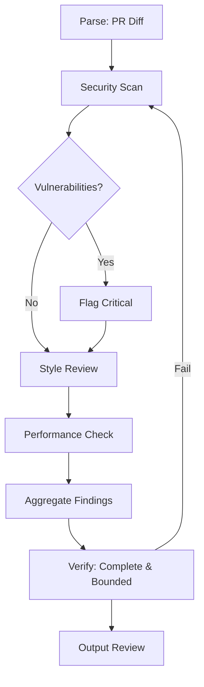
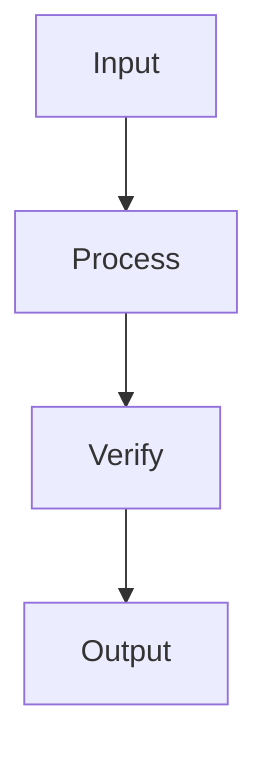
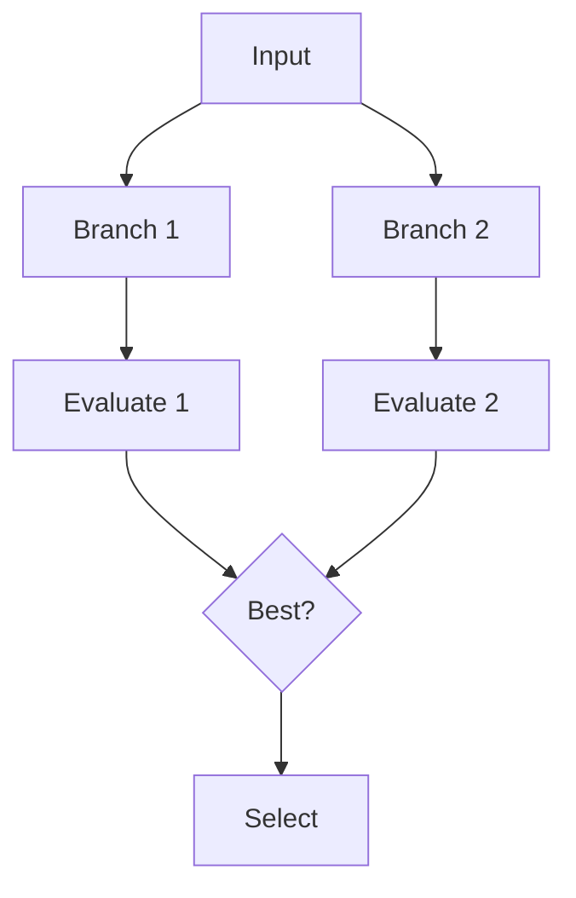
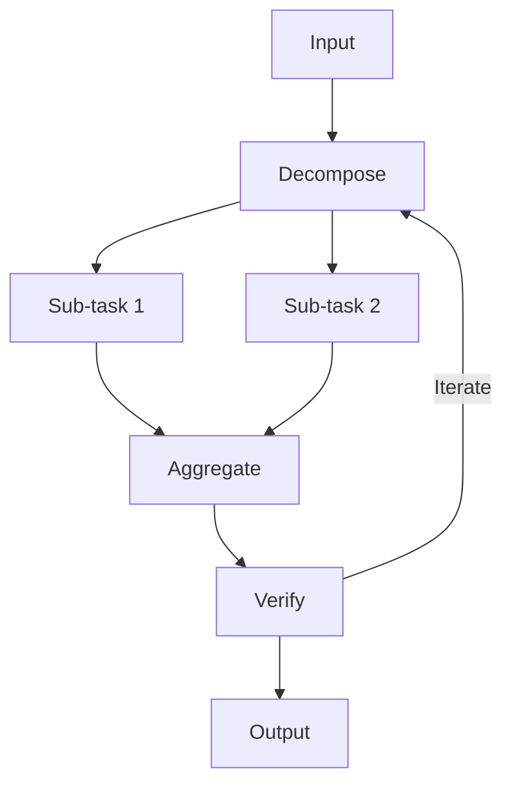

# RFC AIW003: BRAID Reasoning Layer for Agent-Native Cloud Run Functions

**Status**: Proposed  
**Owners**: Platform Eng  
**Reviewers**: AI/ML, App and Service Teams  
**Decision Date**: N/A  
**Scope**: Extends the AIW001 golden path and AIW002 local workflow with a structured reasoning layer for Cloud Run Function–based agents. Enables deterministic, auditable, and cost-efficient LLM reasoning—a critical requirement for agent-native workloads in regulated enterprises where explainability is non-negotiable.

---

## Architecture Relationship

This RFC builds directly on the agent-native golden path (AIW001) and local development workflow (AIW002). Where AIW001 defines *how agents execute* and AIW002 defines *how teams iterate*, AIW003 defines *how agents reason*—and crucially, how that reasoning is made visible, bounded, and auditable for organizations that require explainability of autonomous decisions.

| Component | AIW001/002 Foundation | AIW003 Extension |
|-----------|----------------------|------------------|
| **Cloud Run Functions** | Spawns headless agent CLI | Agents use BRAID for structured reasoning before execution |
| **Message Contract** | JSON payload with `agent.args` | Extends with `reasoning` field for GRD execution |
| **Pub/Sub Flow** | Router → Topic → Worker | Worker decodes BRAID GRDs before agent invocation |
| **Local Testing** | Functions Framework + emulators | Adds BRAID encoder/decoder test utilities |
| **Explainability** | Cloud Logging with `correlation_id` | Logs include GRD execution traces for full auditability |

**Position in Stack**: BRAID operates as the **reasoning layer** between incoming task requests and agent execution. When a Cloud Run Function worker receives a message, it can optionally pre-process the task through BRAID encoding to create a deterministic execution plan before invoking the agent CLI. This is the explainability primitive for the golden path: every agent decision can be traced back to a graph of bounded reasoning nodes.

```
┌─────────────────────────────────────────────────────────────────┐
│  Agent Execution Flow (Extended from AIW001)                    │
│                                                                 │
│  Pub/Sub Message                                                │
│       │                                                         │
│       ▼                                                         │
│  ┌─────────────────┐    ┌─────────────────┐    ┌─────────────┐│
│  │  Worker Function│───▶│  BRAID Encoder  │───▶│ Cursor CLI  ││
│  │  (Node.js)      │    │  (Reasoning)    │    │ (Execution) ││
│  └─────────────────┘    └─────────────────┘    └─────────────┘│
│                                │                               │
│                                ▼                               │
│                    ┌───────────────────────┐                  │
│                    │  GRD (Mermaid Graph)  │                  │
│                    │  - Deterministic path │                  │
│                    │  - Bounded reasoning  │                  │
│                    │  - Verification nodes │                  │
│                    └───────────────────────┘                  │
└─────────────────────────────────────────────────────────────────┘
```

---

## 1) Problem Statement

The Cloud Run Function workers defined in AIW001 spawn headless agent CLIs for tasks like PR reviews, Jira triage, and Slack automation. However, complex reasoning tasks face challenges that become acute in enterprise environments where regulators, auditors, and compliance teams need to understand *why* an autonomous agent made a particular decision:

- **Unbounded reasoning**: Agents may produce verbose, inconsistent outputs. In a multi-tenant enterprise, inconsistency between agent runs for similar inputs erodes trust.
- **Cost inefficiency**: Chain-of-Thought (CoT) approaches consume excessive tokens. At enterprise scale, token cost is a real operational concern.
- **Hallucination risk**: Unstructured reasoning drifts from task constraints. For regulated industries, a hallucinated action on a production system is not just a bug—it is a compliance event.
- **Audit difficulty**: Natural-language reasoning chains are hard to trace. When an auditor asks "why did the agent approve this PR?", the answer must be more structured than a wall of text.

BRAID (Bounded Reasoning for Autonomous Inference and Decisions) addresses these by encoding reasoning into compact Guided Reasoning Diagrams (GRDs) that enforce deterministic execution paths. It is the explainability and traceability layer that makes the AIW001 golden path viable for stringent enterprise use cases.

---

## 2) Solution: BRAID as the Reasoning Layer

BRAID transforms agent prompts into Mermaid-based GRDs before execution, yielding:

- **75x+ token cost reduction** through atomic nodes (≤15 tokens each)
- **2-3x accuracy improvement** via deterministic branching and verification loops
- **Near-zero hallucinations** through bounded reasoning paths
- **Full auditability** with traceable graph execution

### How It Integrates with the Golden Path

The Cloud Run Function worker from AIW001 is extended to optionally invoke the BRAID encoder before agent execution. This is a composable layer—teams can adopt BRAID incrementally without changing their function structure or deployment model:

```typescript
// functions/worker.ts (extended from AIW001)
import { cloudEvent } from "@google-cloud/functions-framework";
import { braidEncode, braidDecode } from "../lib/braid";
import { runCursorAgent } from "../lib/cursor";
import { logger } from "../utils/logger";

cloudEvent("worker", async (event) => {
  const msg = decodeMessage(event);
  const correlationId = msg.correlation_id;

  logger.info("Processing message", { correlationId, agent: msg.agent?.name });

  // BRAID encoding for complex reasoning tasks
  let executionPlan = msg;
  if (msg.agent?.useBraid) {
    const grd = await braidEncode(msg.agent.args.prompt, {
      flavor: msg.agent.args.braidFlavor || "default",
      constraints: msg.agent.args.constraints,
    });
    
    logger.info("BRAID GRD generated", { correlationId, nodeCount: grd.nodeCount });
    
    executionPlan = {
      ...msg,
      reasoning: {
        grd: grd.mermaid,
        compliance: grd.principlesCompliance,
      },
    };
  }

  const result = await runCursorAgent(executionPlan);
  
  // Post to configured sinks (GitHub, Slack, Jira per AIW001)
  await postResults(msg.reply, result, correlationId);
});
```

---

## 3) Extended Message Contract

The Pub/Sub message contract from AIW001 Section 7 is extended to support BRAID:

```jsonc
{
  "version": "1.0",
  "correlation_id": "uuid-v4",
  "agent": {
    "name": "pr-reviewer",
    "useBraid": true,  // Enable BRAID reasoning layer
    "args": {
      "repo": "org/repo",
      "pr": 123,
      "prompt": "Review this PR for security issues and suggest improvements",
      "braidFlavor": "tree-of-thoughts",  // Optional: GoT, ToT, default
      "constraints": ["max_suggestions: 5", "focus: security"]
    }
  },
  "context": {
    "repo_ref": "org/repo#sha",
    "artifacts": ["gs://bucket/diff.patch"]
  },
  "reasoning": {
    // Populated by BRAID encoder before Cursor CLI execution
    "grd": "flowchart TD; ...",
    "compliance": { "nodeAtomicity": 0.95, "hallucinationMitigation": 1.0 }
  },
  "reply": {
    "type": "github.pr_review",
    "targets": { "repo": "org/repo", "pr": 123 }
  }
}
```

---

## 4) BRAID Encoder/Decoder Implementation

### 4.1 Core Library

```typescript
// lib/braid/index.ts
import { BRAIDEncodeOutput, BRAIDDecodeOutput, BRAIDConfig } from "./types";

const SYSTEM_PROMPT = `You are a BRAID Encoder/Decoder Agent. BRAID (Bounded Reasoning for Autonomous Inference and Decisions) converts prompts into Guided Reasoning Diagrams (GRDs) in Mermaid syntax.

Core Principles:
1. Node Atomicity: Nodes ≤15 tokens, logic over narration
2. Procedural Scaffolding: Encode facts/constraints/goals symbolically, use <MASK> for sensitive values
3. Deterministic Branching: Use conditional edges (A -- "If X" --> B | else --> C)
4. Terminal Verification: End with multi-check nodes (accuracy, hallucination risk)
5. Hallucination Mitigation: Enforce bounded reasoning, no unbounded expansions
6. Scalability: Support decomposition into sub-graphs for multi-agent flows

Output valid JSON per the BRAIDOutput schema. Mermaid must start with 'flowchart TD;'.`;

export async function braidEncode(
  prompt: string,
  config: BRAIDConfig = {}
): Promise<BRAIDEncodeOutput> {
  const { flavor = "default", constraints = [] } = config;
  
  const userMessage = `encode: ${prompt}
Flavor: ${flavor}
Constraints: ${constraints.join(", ")}`;

  const response = await callLLM(SYSTEM_PROMPT, userMessage);
  return validateEncodeOutput(response);
}

export async function braidDecode(mermaid: string): Promise<BRAIDDecodeOutput> {
  const userMessage = `decode: ${mermaid}`;
  const response = await callLLM(SYSTEM_PROMPT, userMessage);
  return validateDecodeOutput(response);
}
```

### 4.2 Types

```typescript
// lib/braid/types.ts
export interface BRAIDConfig {
  flavor?: "default" | "graph-of-thoughts" | "tree-of-thoughts";
  constraints?: string[];
}

export interface BRAIDEncodeOutput {
  type: "encode";
  mermaid: string;
  humanReadableSummary: string;
  nodeCount: number;
  principlesCompliance: {
    nodeAtomicity: number;
    proceduralScaffolding: number;
    deterministicBranching: number;
    terminalVerification: number;
    hallucinationMitigation: number;
    scalabilityForAgents: number;
  };
  refinementSuggestions: string[];
}

export interface BRAIDDecodeOutput {
  type: "decode";
  reconstructedPrompt: string;
  stepByStepDescription: string;
  potentialImprovements: string[];
}

export type BRAIDOutput = BRAIDEncodeOutput | BRAIDDecodeOutput | { error: string };

export function validateEncodeOutput(output: unknown): BRAIDEncodeOutput {
  if (!output || typeof output !== "object") {
    throw new Error("Invalid BRAID output: not an object");
  }
  
  const o = output as Record<string, unknown>;
  if (o.type !== "encode" || typeof o.mermaid !== "string") {
    throw new Error("Invalid BRAID encode output");
  }
  
  if (!o.mermaid.startsWith("flowchart TD;")) {
    throw new Error("Invalid Mermaid: must start with 'flowchart TD;'");
  }
  
  return output as BRAIDEncodeOutput;
}
```

---

## 5) Use Case Integration

### 5.1 PR Reviews (from AIW001 Section 11.A)

BRAID improves PR review agents by creating structured review plans:

**Without BRAID**: Agent receives diff and produces unstructured comments, potentially missing critical issues or producing inconsistent feedback.

**With BRAID**: Worker encodes the review task into a GRD that ensures:
- Security checks are always performed first
- Code style review follows security
- Performance concerns are identified
- Summary aggregates all findings

```typescript
// Example: PR review with BRAID
const prReviewMessage = {
  agent: {
    name: "pr-reviewer",
    useBraid: true,
    args: {
      prompt: "Review PR #123 for security, style, and performance",
      braidFlavor: "tree-of-thoughts",
      constraints: ["security_first", "max_comments: 10"],
    },
  },
  // ...
};
```

Generated GRD for PR review:



### 5.2 Jira Triage (from AIW001 Section 11.B)

BRAID ensures consistent ticket categorization:

```typescript
const triageMessage = {
  agent: {
    name: "jira-triage",
    useBraid: true,
    args: {
      prompt: "Categorize and prioritize backlog tickets",
      constraints: ["categories: bug|feature|tech-debt", "priority: P0-P3"],
    },
  },
};
```

### 5.3 Slack Agents (from AIW001 Section 11.C)

BRAID constrains response length and tone for Slack interactions:

```typescript
const slackMessage = {
  agent: {
    name: "slack-assistant",
    useBraid: true,
    args: {
      prompt: "Answer user question about deployment process",
      constraints: ["max_tokens: 500", "tone: professional", "include_links: true"],
    },
  },
};
```

---

## 6) Local Testing (Extends AIW002)

Local testing of BRAID follows the same zero-friction philosophy as AIW002: no cloud resources required, no container builds, just Functions Framework + test scripts. Teams can iterate on GRD quality and reasoning structure as fast as they iterate on function logic.

### 6.1 BRAID Test Utilities

Add test utilities consistent with AIW002 Section 5:

```typescript
// src/scripts/test-braid.ts
import { braidEncode, braidDecode } from "../lib/braid";

async function testBraidEncode() {
  const result = await braidEncode(
    "Review code for security vulnerabilities and suggest fixes",
    { flavor: "tree-of-thoughts", constraints: ["max_suggestions: 5"] }
  );
  
  console.log("Encode result:");
  console.log("- Mermaid:", result.mermaid.slice(0, 100) + "...");
  console.log("- Node count:", result.nodeCount);
  console.log("- Compliance:", result.principlesCompliance);
}

async function testBraidDecode() {
  const mermaid = `flowchart TD;
A[Parse Input] --> B[Identify Issues];
B --> C{Critical?};
C -- "Yes" --> D[Flag];
C -- "No" --> E[Log];
D --> F[Verify];
E --> F;
F --> G[Output];`;

  const result = await braidDecode(mermaid);
  console.log("Decode result:");
  console.log("- Reconstructed:", result.reconstructedPrompt);
  console.log("- Improvements:", result.potentialImprovements);
}

testBraidEncode().then(testBraidDecode).catch(console.error);
```

### 6.2 npm Scripts (Extends AIW002 Section 4.2)

```json
{
  "scripts": {
    "dev:router": "functions-framework --target=router --port=8080 --source=dist",
    "dev:worker": "functions-framework --target=worker --port=8081 --source=dist",
    "test:braid": "ts-node src/scripts/test-braid.ts",
    "test:braid:encode": "ts-node -e \"require('./src/lib/braid').braidEncode('Your prompt here').then(console.log)\"",
    "test:worker:braid": "curl -X POST http://localhost:8081 -H 'Content-Type: application/json' -d @test-payloads/braid-pr-review.json"
  }
}
```

### 6.3 Test Payload

```json
// test-payloads/braid-pr-review.json
{
  "agent": {
    "name": "pr-reviewer",
    "useBraid": true,
    "args": {
      "repo": "test/repo",
      "pr": 123,
      "prompt": "Review this PR for security issues",
      "braidFlavor": "default",
      "constraints": ["security_focus", "max_comments: 5"]
    }
  },
  "context": { "test": true },
  "reply": { "type": "github.pr_review" }
}
```

---

## 7) Observability (Extends AIW001 Section 12)

### 7.1 Structured Logging with GRD Traces

```typescript
// utils/logger.ts (extended)
export const logger = {
  braidTrace: (correlationId: string, grd: string, compliance: Record<string, number>) => {
    const entry = {
      severity: "INFO",
      correlation_id: correlationId,
      component: "braid",
      grd_hash: hashGRD(grd),
      node_count: countNodes(grd),
      compliance,
      timestamp: new Date().toISOString(),
    };
    
    if (process.env.NODE_ENV === "production") {
      console.log(JSON.stringify(entry));
    } else {
      console.log("[BRAID]", entry);
    }
  },
};
```

### 7.2 Metrics

Add BRAID-specific metrics to the SLO framework from AIW001:

| Metric | Target | Description |
|--------|--------|-------------|
| `braid.encode.latency_p95` | <500ms | Time to generate GRD from prompt |
| `braid.compliance.node_atomicity` | >0.9 | Average node atomicity score |
| `braid.hallucination_rate` | <1% | Percentage of outputs flagged for drift |

---

## 8) BRAID Flavors

Different reasoning patterns for different task types:

### 8.1 Default (Linear)

Best for straightforward tasks with clear steps:



### 8.2 Tree of Thoughts (ToT)

Best for exploratory tasks with multiple solution paths:



### 8.3 Graph of Thoughts (GoT)

Best for complex tasks requiring parallel exploration:



---

## 9) Security and Compliance Considerations

BRAID strengthens the security posture of the AIW001 golden path and provides the explainability layer that regulated enterprises require. For organizations in banking, telecom, or government, the ability to produce a deterministic, hashable reasoning trace for every autonomous agent action is not a nice-to-have—it is a prerequisite for deploying agents beyond sandbox environments.

- **Masking**: Sensitive values use `<MASK>` tokens, preventing data leakage in logs and GRD artifacts
- **Bounded execution**: GRDs prevent unbounded agent expansion that could consume excessive resources or drift into unintended actions
- **Audit trail**: Every GRD is hashable and traceable via `correlation_id`. When stored in GCS with retention policies, these form a compliance-ready record of agent reasoning
- **Compliance validation**: Outputs are validated against the schema before execution. Failed validations are logged and can trigger human-in-the-loop review via the escape hatches described in AIW001 Section 11
- **Deterministic reproducibility**: Given the same input and GRD, the agent's execution path is reproducible. This enables post-incident analysis and regulatory reporting

---

## 10) Rollout Plan

Integrates with the speed-oriented rollout from AIW001 Section 19. BRAID adoption is incremental and opt-in—no existing agent functions need to change until a team is ready.

1. **Phase 1**: Add BRAID library to `agents-mono` package. No changes to existing functions.
2. **Phase 2**: Enable `useBraid: true` for PR reviewer agent in shadow mode. Agent generates GRDs but does not use them for execution—compare reasoning quality side-by-side.
3. **Phase 3**: Compare metrics between BRAID and non-BRAID executions. Measure token cost reduction, output consistency, and compliance score improvements.
4. **Phase 4**: Roll out to Jira triage and Slack agents. Begin persisting GRD artifacts to GCS for audit trail.
5. **Phase 5**: Default BRAID to `true` for all complex reasoning tasks. At this point, the organization has a fully auditable, explainable agent reasoning layer running on the Cloud Run Functions golden path.

---

## 11) Open Questions

- Should BRAID GRDs be stored in GCS for replay/debugging? For regulated environments, the answer is likely yes—with retention policies matching the organization's compliance window.
- What's the fallback behavior if BRAID encoding fails? The golden path default should be to proceed without BRAID (agent executes with unstructured reasoning) and log the failure, rather than blocking execution. Fail-open for experimentation; fail-closed can be a production configuration.
- Should we expose BRAID compliance scores in Slack responses? This could build trust with stakeholders who are skeptical of autonomous agent output.
- As agentic reasoning frameworks mature in 2026 (structured tool-use chains, MCP-based reasoning graphs, multi-agent deliberation), should BRAID evolve to emit MCP-compatible reasoning traces in addition to Mermaid GRDs?

---

## 12) References

- AIW001: Agent-Native Golden Path on GCP Cloud Run Functions
- AIW002: Local Development Workflow — Zero-to-Agent in Minutes
- [BRAID Paper] Amcalar, A., & Cinar, E. (2025). BRAID: Bounded Reasoning for Autonomous Inference and Decisions. arXiv:2512.15959
- [Graph of Thoughts] Besta et al. (2023). Graph of Thoughts: Solving Elaborate Problems with Large Language Models
- [Tree of Thoughts] Yao et al. (2023). Tree of Thoughts: Deliberate Problem Solving with Large Language Models
- [Model Context Protocol (MCP)](https://modelcontextprotocol.io/) — Emerging standard for agent tool-use and context sharing